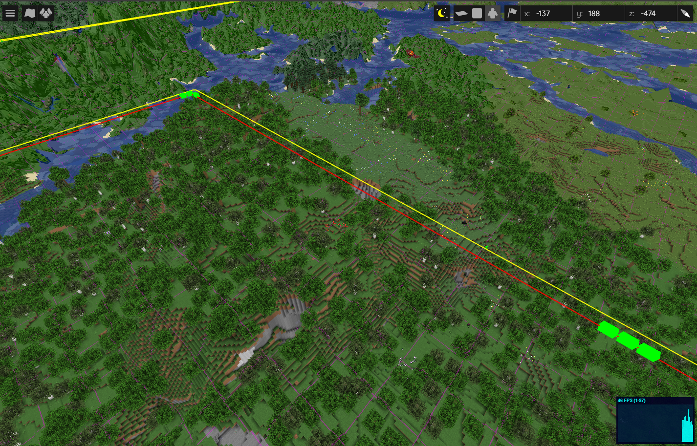

# Create Track train
This is a script that adds a an overlay for the [create track map](https://modrinth.com/mod/create-track-map) mod to your BlueMap website.

## Installation Instructions
Download or copy the [train.js](train.js) file to your webapp, and register it.
([guide](https://bluemap.bluecolored.de/community/Customisation.html#custom-scripts-behaviour))

Change the host variable to your create track train url